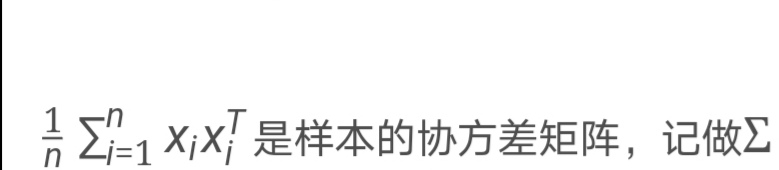

###PCA-主成分分析
- 
- 基于最大方差理论下的PCA公式推导---最大方差理论和最小平方误差理论下的PCA(主成分分析)的公式推导.mht

****
- 数字特征：
    1. 固定t时的单个随机变量的X(t)的期望E[X(t)]为过程的均值函数记为u(t)。
    2. 而Var[X(t)]则被定义为过程的方差函数。
    3. 同理Cov(X(t1),X(t2))则称为过程的协方差函数，即等于=E{(X(t1)-u(t1))(X(t2)-u(t2))}
- 平稳过程
    * 严平稳过程：如果对随机过程有：对任一的有限维分布和其相应的任意的间隔h后的有限维分布是等分布，则此随机过程是严平稳过程。此条件很强也不易验证，所以退而求其次有所谓宽平稳过程或二阶平稳过程。
    * 宽平稳过程：如果随机过程的X(t)的所有二阶矩存在并有EX(t)=m及协方差函数只与时间差t-s有关，则称作是宽平稳的或者二阶矩平稳的。
- 独立增量过程：如果对任何t1,...,tnT,t1<t2<....<tn,随机变量X(t2)-X(t1),X(t3)-X(t2),...,X(tn)-X(tn-1)是相互独立的则X(t)称为是独立增量过程。
- 矩母函数：
    * g(t) = E[e^(tx)],并且有X的n阶钜与矩母函数n阶导数的关系：E[X^n]=g^(n)(0),n>=1,其中g^(n)(t)是g(t)的n阶导数。---证明见：矩量母函数—搜狗百科.mht。
    * 服从Poisson分布随机变量的矩母函数计算Demo。
- 生成函数：若X为离散随机变量则期望E[s^x]为其概率生成函数。
##泊松(Poisson)过程
- 定义：一个整数值随机过程{N(t),t>=0}满足下述三个条件就称作强度(或速率)为r的Poisson过程。
    * N(0) = 0;
    * N(t)是独立增量过程；
    * 对任何t>0,s>=0增量N(s+t)-N(s)服从参数为rt的Poisson分布，即：  
    P{N(s+t)-N(s)=k}=[(rt)^(k)e^(-rt)]/(k!)
- 命题2.1 满足假定(1)-(4)的随机过程N(t)为Poisson过程。---证明见:随机过程及其应用_随机过程.pdf.19页
- 稀有事件的概率常服从Poisson分布。这是由于当试验次数很多而每次试验成功的概率很小时，二项分布可以逼近Poisson分布。---证明见：二项分布的泊松分布近似（Mathematica）-百度经验.mht

- 原问题与对偶问题Slater条件与KKT条件
- 核函数的由来
- 几个常用的核函数的公式以及意义
- 选用支持向量间隔最大化和全部数据点间隔最大化的区别
- 为什么函数间隔设置为1，不影响优化
- 拉格朗日乘子法不等号约束情形
- 证明SVM

####dsfa
1. Sample first item.

    * sub-bullet one
    * sub-bullet two

2.  Continuing the list

    1. sub-list numbered one
    2. sub-list numbered two

3.  Another list item.
